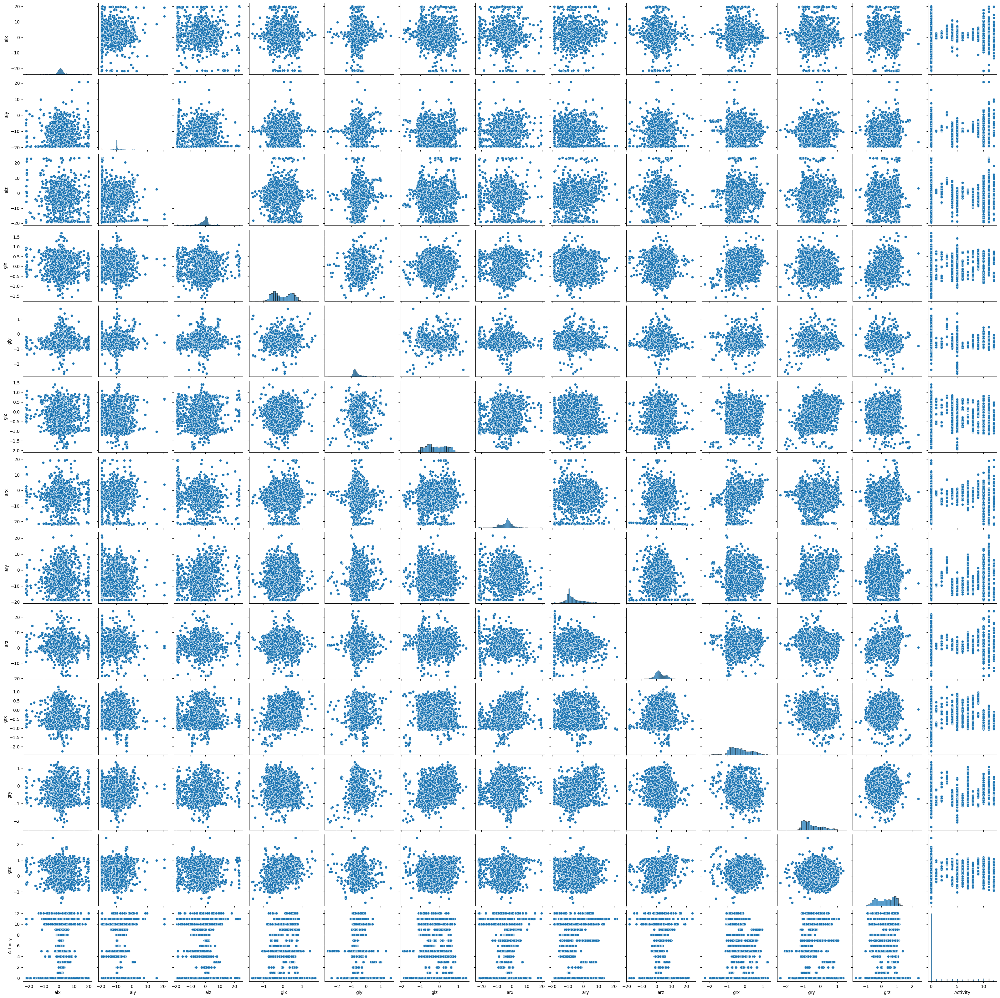
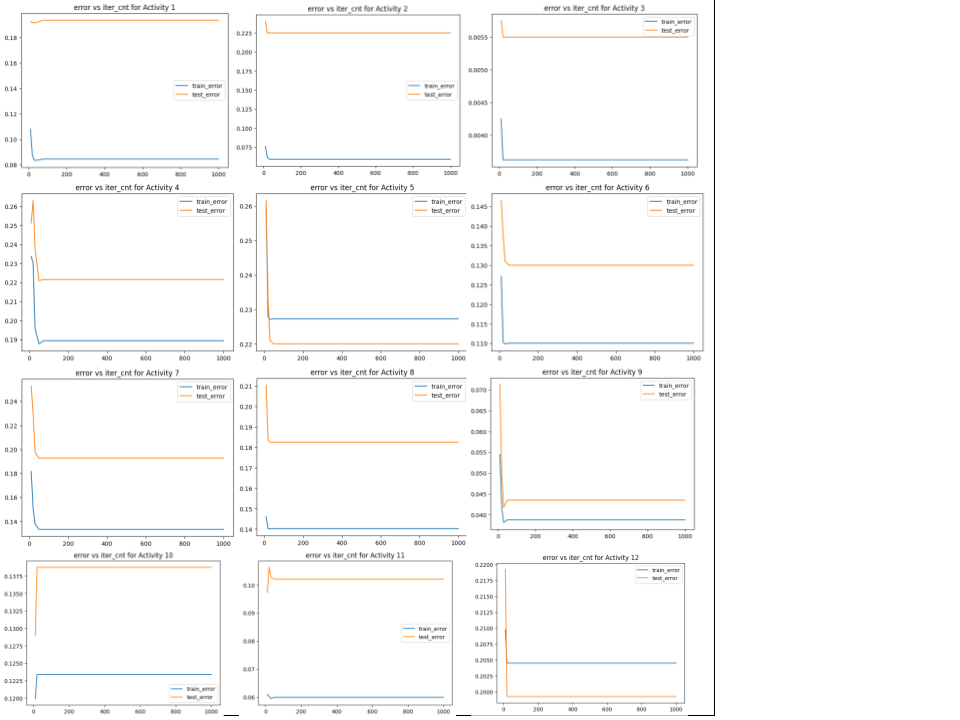
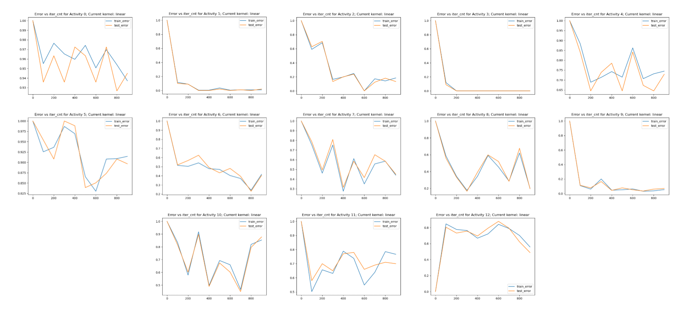
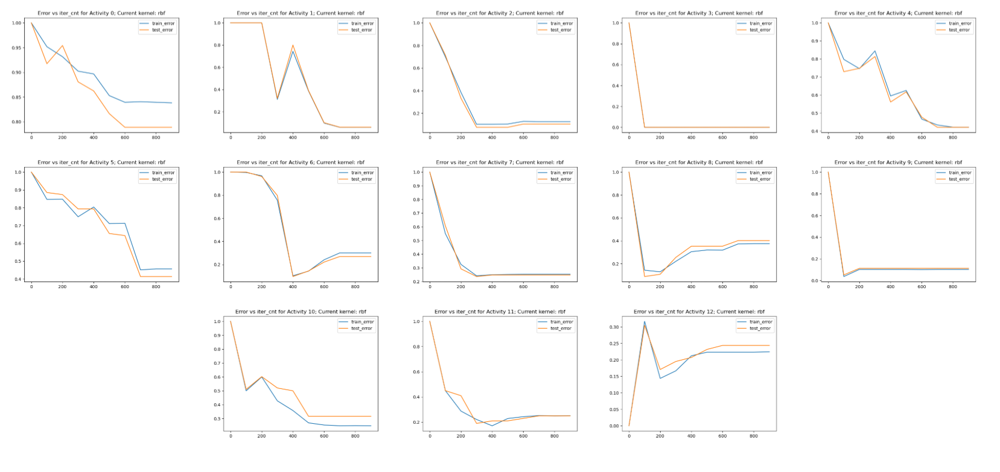
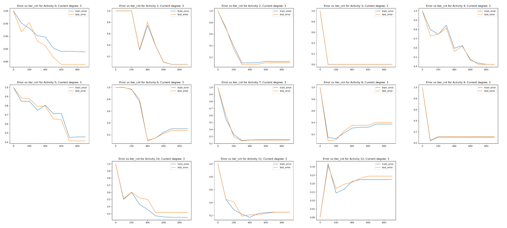
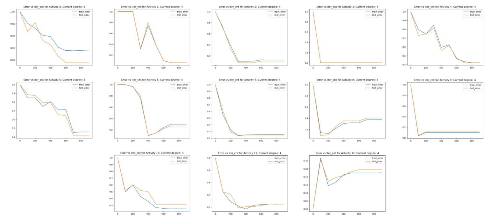
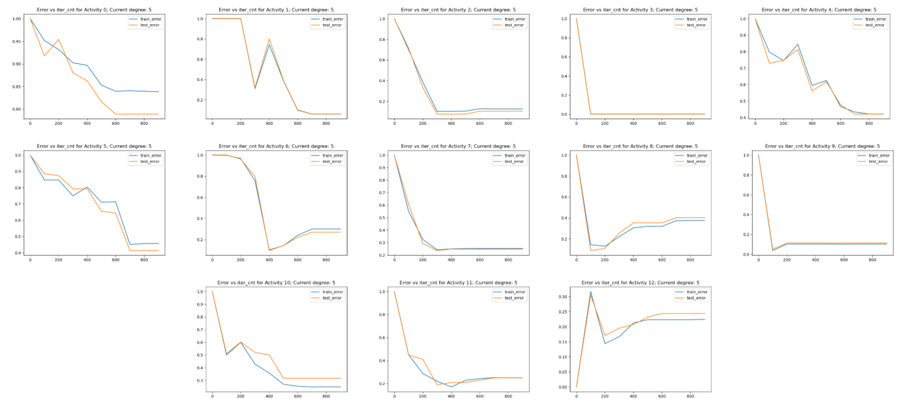
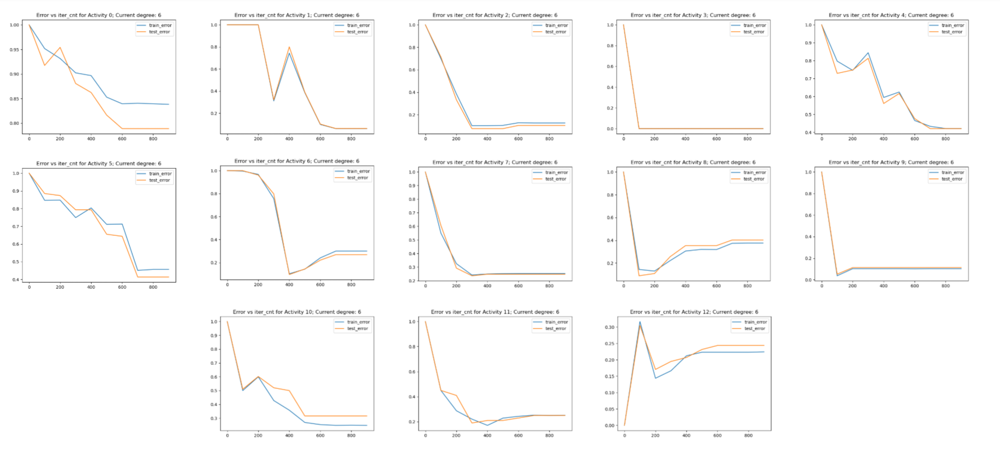

# CSE151A_Group_Project

## Milestone 2

How will you preprocess your data? You should only explain (do not perform pre-processing as that is in MS3) this in your README.md file and link your Jupyter notebook to it. All code and  Jupyter notebooks have be uploaded to your repo.

How will we preprocess our data:
* We will drop the subject column from our data as it contains nothing of value: the only information it provides is the information regarding the participant performing the physical activity
* normalize the data through min-max normalization
* random sample our data to contain 4,000 entries instead of the full > 1.2 million entries for visualizing the data since generating a pairplot was taking too long to run
* We have identified that around 800,000 to 900,000 of the samples were the participants standing still and we intend on either dropping or sampling to an appropriate size of individuals standing still

Columns:
1. Subject - The identifier for the subject performing the action in the data
2. alx - The acceleration in the X direction of the sensor while the subject is performing motions
3. aly - The acceleration in the Y direction of the sensor while the subject is performing motions
4. alz - The acceleration in the Z direction of the sensor while the subject is performing motions
5. arx - The rate of change of the accelerations in the X direction while the subject is performing motions
6. ary - The rate of change of the accelerations in the Y direction while the subject is performing motions 
7. arz - The rate of change of the accelerations in the Z direction while the subject is performing motions 
8. glx - The gyroscrope data of the X location while the subject is performing motions
9. gly - The gyroscrope data of the Y location while the subject is performing motions
10. glz - The gyroscrope data of the Z location while the subject is performing motions
11. grx - The rate of change of the gyroscope data in the X direction while the subject is performing motions
12. gry - The rate of change of the gyroscope data in the Y direction while the subject is performing motions
13. grz - The rate of change of the gyroscope data in the Z direction while the subject is performing motions
14. Activity - The class of what activity the subject is performing

What we checked:
* We checked if the categories for the activities needed to be encoded and they were already numerically encoded so no work needs to be done here
* We checked if there were any null or invalid entries within our dataset. Ultimately, we did not find any and thus do not need to remove any values in the upcoming preprocessing milestone

## Milestone 3
Preprocessing:
* We dropped the subject column.
* We took 10,000 random samples of each activity to ensure an equal number of observaions for each.
* We used min-max scaling to scale all the input data.
* There was no need to encode our data since our data was already in floats and ints. We encoded the output class `Activity` for each of our Logistic regression models.
* We used feature expansion to create a magnitude of acceleration for each hand (left and right) using the x, y, and z acceleration values, with the goal of improving correlation of Activities to the rest of the data. 

We trained our first model using logistic regression to predict an Activity based on acceleration and gyroscope data.
* For each activity model, we encoded the output as 1 for the activity and 0 for the other activities. 

* We made a classification report to measure training vs testing error for each Activity's logistic regression prediction model

The example ground truth is the Activity type of the observation. For each model i this is encoded as `not Activity i = 0` and `Activity i = 1`. We expect our test accuracy to be lower than training accuracy, since the model is trained on the training data. 

Where does your model fit in the fitting graph?  
Our model fit early in the fitting graph because as we measured iteration count on the logisitic regrssion models, we see that both the training and testing errors doesn't improve much after around iteration 30-100 which is very early in a logistic regression model. This shows our data is low complexity.

What are the next models you are thinking of and why?  
We are thinking of SVMs because we can categorically sort the Activities on a graph to show correlation between acceleration and gyroscope data to a certain Activity. We can also use one model to classify all the activities, rather than a separate model for each activity.

Link to Jupyter Notebook Fitting Graph and Logistic Regression Models:
[jupyter notebook link](https://github.com/timothychu99/CSE151A_Group_Project/blob/Milestone3/Milestone3_Logistic_Regression.ipynb)

Conclusion  
The conclusion of our 1st model is that it performs better than random and for some activities performs very well in terms of predicting the correct Activity based on acceleration and gyroscope sensory data. However, for Activity 0 it did not perform as well. For several of the activities the training accuracy is much higher than the test accuracy, which can be an indication of overfitting. We can improve this model by labeling the data better and using a very good model called Support Vector Machine. Support Vector Machine will categorize our data better than using logistic regression because it could categorize multiple activities on a singular graph. This will help us compare Activities with more accuracy.

## Milestone 4
Based on feedback from Milestone 3, we changed our first model from Logistic Regression, where we made individual classifiers, to K-Nearest Neighbors to make it easier to find an overall accuracy and allow us to compare the results to our second model, SVM. The KNN model had an overall train accuracy of 0.93 and test accuracy of 0.61 after fine-tuning k to 19. Given the large difference in accuracies, this could indicate overfitting in our model. We then moved on to the second model, SVM.

The KNN model fits in the fitting graph in regards to k correlating to the model complexity, with higher k values being higher model complexity. This is because when testing with increasing k values, we saw that it plateaus at a testing error of around 0.39. For proof, please check the [KNN_accuracy_results.txt](./KNN_accuracy_results.txt)

Link to Jupyter Notebook SVM and KNN Models:
[jupyter notebook link](https://github.com/timothychu99/CSE151A_Group_Project/blob/Milestone4/Milestone4_KNN_%26_SVM_models.ipynb)

1: Train your second model. Make sure you use a different model than in MS3, and you must fine-tune your model to get an accurate comparison.

Our second model is SVM, we redone our previous model to be KNN instead of the Logistic Regression to get a better comparison.

2: Evaluate your model and compare training vs. test error

We have done this for both SVM and KNN test and train accuracies.

In order to convert this to training and test error, we will compute the following equations:
* testing error = 1 - testing accuracy
* training error = 1 - training accuracy
for the best (Linear) SVM model measured in terms of lowest testing error:
* training accuracy = 0.7314529914529915
* testing accuracy = 0.7476923076923077
* training error = 0.2685
* testing error = 0.2523

for the best (k = 19) KNN model measured in terms of lowest testing error:
* training accuracy = 0.9257606837606838
* testing accuracy = 0.6079230769230769
* training error = 0.07423
* testing error = 0.3921

3: Answer the questions: Where does your model fit in the fitting graph? and What are the next models you are thinking of and why?

The SVM model overall has a higher model complexity than KNN, so it would be further to the right in the fitting graph. In regards to the model complexity, a higher polynomial SVM would also indicate a higher model complexity. From the classification reports, with increasing polynomials, it fully plateaued at testing accuracy of 0.72 for all polynomials greater or equal to 2. This is equal to a testing error of 0.28. For the Linear SVM model, the testing accuracy was a 0.74 which is equivalent to a testing error of 0.26, which is the lowest error we see from testing the SVM models. For proof, please check [SVM_accuracy_results.txt](./SVM_accuracy_results.txt)

Next, we are thinking that we could perform PCA on our dataset. Since a lot of the features are related to each other, both in terms of type of movement (acceleration and gyroscope) and origin of data (left or right hand), they might be better explained by principal components rather than as separate features.

4: Update your README.md to include your new work and updates you have all added. Make sure to upload all code and notebooks. Provide links in your README.md

DONE

5: Conclusion section: What is the conclusion of your 2nd model? What can be done to possibly improve it? Note: The conclusion section should be it's own 
independent section. i.e. Methods: will have models 1 and 2 methods, Conclusion: will have models 1 and 2 results and discussion. 

We conclude that our SVM model (our 2nd model) is an improvement over our KNN model. It predicted with 74% accuracy on the test data. Comparing each output Activity, there was improvement in f1 score for most activities, but Activity 10, 11, and 12 performed worse. The training data had a similar accuracy, indicating that the model is likely not overfitting the training data, which is good. We tried different types of SVM kernels but did not see much change to our results. Therefore, the only way we can likely improve the model is to change how the data is input to the model, as mentioned above. We had to sample our data so that it could perform SVM in a reasonable time, so we could try running it on the same dataset that we used for KNN. We could also try other models like K-means, Naive Bayes, or RBF.

6: Provide predictions of correct and FP and FN from your test dataset.

In terms of FP and FN, we have multiple classes and our y_test data is in terms of which activity is predicted. As a result, FP and FN don't make sense for the overall model because it is not binary data. We can get an idea of these values by looking at the precision and recall output for each Activity (in the txt files linked above). For the predictions of correct on our test dataset, we are able to do compute it.

Correct = accuracy * length of test_dataset

Predictions of correct for Linear SVM model:

`SVM test set size = 0.1 * 13000 = 1300`

`Correct = 0.7476923076923077 * 1300 = 972`

Predictions of correct for (k=19) KNN model:

`KNN test set size = 0.1 * 130000 = 13000`

`Correct = 0.6079230769230769 * 13000 = 7903`

# Milestone 5

# Final Report

## Introduction
We chose to work with exercise data because exercise is important for human health. Many people who exercise utilize applications and trackers to track their movements and exercise progress. This helps them obtain metrics about the activities being performed. This is cool because using these trackers data, we can accurately reflect what movements the subject is performing. This allows people to compare their movement data with others, or help categorize their movements into different exercises. Having a good predictive model for this would allow more people to track the efficency of their movement and types of exercise performed. This allows them to accurately predict which movement they are performing and can possibly let them know if they are doing a movement incorrectly, which is important when learning how to do or practice different exercises. We used a publicly available dataset of the physical movements of participants performing various activities where the sensors are polling at 50 hertz for a total of over 1.2 million samples. Using machine learning techniques, we analyzed and identified what exercise is performed based on acceleration and rotational sensor data. We created a classification model on acceleration and gyroscope data to predict movement type.

## Methods

### Data Exploration
First, we had to explore our data before we work with it. We used a publicly available dataset of the physical movements of participants performing various activities where the sensors are polling at 50 hertz for a total of over 1.2 million samples. Our exercise data is comprised by the following columns:

Columns:
1. Subject - The identifier for the subject performing the action in the data
2. alx - The acceleration in the X direction of the sensor while the subject is performing motions
3. aly - The acceleration in the Y direction of the sensor while the subject is performing motions
4. alz - The acceleration in the Z direction of the sensor while the subject is performing motions
5. arx - The rate of change of the accelerations in the X direction while the subject is performing motions
6. ary - The rate of change of the accelerations in the Y direction while the subject is performing motions 
7. arz - The rate of change of the accelerations in the Z direction while the subject is performing motions 
8. glx - The gyroscrope data of the X location while the subject is performing motions
9. gly - The gyroscrope data of the Y location while the subject is performing motions
10. glz - The gyroscrope data of the Z location while the subject is performing motions
11. grx - The rate of change of the gyroscope data in the X direction while the subject is performing motions
12. gry - The rate of change of the gyroscope data in the Y direction while the subject is performing motions
13. grz - The rate of change of the gyroscope data in the Z direction while the subject is performing motions
14. Activity - The class of what activity the subject is performing

Subject column was a string, Activity was encoded as an int, and everything else was a float.
There were no null or invalid entries present within our dataset.

We determined that we should drop the subject column as it does not contain any useful information. Due to our data size of 1.2 million, we determined that we should do a random sample of our data in order to get 4,000 random entries. As around 800,000-900,000 entries were of people standing still, we determined that we should drop or sample an appropriate size of this to not bias our model. Through our data exploration, we also determined that we should normalize the data through min-max normalization.

Pairplot of the features of the dataset. There are no obvious correlations in the data.

Our data exploration notebook can be found [here](./data_exploration.ipynb)

### Preprocessing

In order to preprocess our data, we first dropped the subject column. We then took 10,000 random samples of each activity to ensure an equal number of observaions for each. We used min-max scaling to scale all the input data. As we planned to have logistic regression models, we encoded the output class `Activity` to be an int (ex. Subject1 --> 1). We used feature expansion to create a magnitude of acceleration for each hand (left and right) using the x, y, and z acceleration values, with the goal of improving correlation of Activities to the rest of the data. 

Our preprocessing section can be found at the start of our [milestone notebook 3](./Milestone3_Logistic_Regression.ipynb)

### Model 1

Using machine learning techniques, we analyzed and identified what exercise is performed based on acceleration and rotational sensor data. We created a classification model on acceleration and gyroscope data to predict movement type.

We trained our first model using logistic regression to predict an Activity based on acceleration and gyroscope data. For each activity model, we encoded the output as 1 for the activity and 0 for the other activities. We then made a classification report to measure training vs testing error for each Activity's logistic regression prediction model.

The example ground truth is the Activity type of the observation. For each model i this is encoded as `not Activity i = 0` and `Activity i = 1`. We predicted test accuracy to be lower than training accuracy, since the model is trained on the training data. 

### Model 1.5

We were then given feedback and changed our first model from Logistic Regression, where we made individual classifiers, to K-Nearest Neighbors to make it easier to find an overall accuracy. We used `sklearn.neighbors.KNeighborsClassifier` to make this model, and tuned the model with different values of k. 

Our first model can be found after the preprocessing in our [milestone notebook 3](./Milestone3_Logistic_Regression.ipynb)

### Model 2

We then trained our second model using support vector machines. We used `sklearn.svm.SVC` and tested linear, rbf, and polynomial kernels with a sample of 1000 observations per activity. 

Our final SVM model can be seen [here](./Milestone4_KNN_&_SVM_models.ipynb)

## Results

### Model 1 Results
Our Logistic Regression models performed better than random, and the accuracy varied for each Activity.

After TA feedback, we changed it to a KNN model. The KNN model had an overall train accuracy of 0.93 and test accuracy of 0.61 after fine-tuning k to 19. Given the large difference in accuracies, this could indicate overfitting in our model.

### Model 2 Results
Our SVM model's seemed to yield between 72% to 75% accuracy regardless of the kernel chosen for both the training and test sets.

Below is the accuracy error rate for different `linear` and `rbf` kernels:

Below is the accuracy error rate using different degree (using kernel=`rbf`):

## Discussion 

For model 2, due to how SVM works, we had to reduce our sampling from 10,000 samples per category of Activities to 1,000 samples per category of Activities. We tested this with various different kernels, specifically the linear, radial bias function, and polynomial kernels. We also tested various degrees when using the polynomial kernel. We found that the best kernel among our SVM models was the linear kernel which yieleded a 73% accuracy on the training data and the 75% accuracy on the test data.

Our Fitting graph discussion:
Our logistic regression model fits early in the fitting graph. As we measured iteration count on the logisitic regrssion models, we saw that both the training and testing errors didn't improve much after around iteration 30-100 which is very early in a logistic regression model. This shows our data is low complexity. 

Overall, the KNN model would place relatively low on the fitting graph, but higher than logistic regression. The KNN model fits in the fitting graph in regards to k correlating to the model complexity, with higher k values being higher model complexity. This is because when testing with increasing k values, we saw that it plateaus at a testing error of around 0.39 as shown in [KNN_accuracy_results.txt](./KNN_accuracy_results.txt)

For both logistic regression and KNN, we saw that our training accuracy was higher than our test accuracy, which could be an indication of overfitting.

The SVM model overall has a higher model complexity than KNN, so it would be further to the right in the fitting graph. In regards to the model complexity, a higher polynomial SVM would also indicate a higher model complexity. From the classification reports, with increasing polynomials, it fully plateaued at testing accuracy of 0.72 for all polynomials greater or equal to 2. This is equal to a testing error of 0.28. For the Linear SVM model, the testing accuracy was a 0.74 which is equivalent to a testing error of 0.26, which is the lowest error we see from testing the SVM models. Our results for each one of the various kernels with the SVM model are detailed in the following file: [SVM_accuracy_results.txt](./SVM_accuracy_results.txt)

## Conclusion

We conclude that our SVM model performed the best at predicting the exercise activity based on the acceleration and gyroscope data, with a training and testing accuracy around 74%. Furthermore, the difference between the train and test accuracy is low, indicating that the model is likely not overfitting the data. In future exporation of this data, we could try changing our data input to our model by calculating the feature expansions differently or using PCA, for example. We could also try different models like Naive Bayes, Decision trees, or a neural network.

## Statement of Collaboration

We met as a group for each milestone and worked on completing it together. 

| Name | Title | Contribution |
| -----| ----- | ------------ |
| Alexander Tahan | Coder & Writer | Wrting, Coding, Collaborating |
| Eugene Lee | Coder & Writer | Wrting, Coding, Collaborating |
| Bryton Lee | Coder & Writer | Wrting, Coding, Collaborating |
| Caylin Canoy| Coder & Writer | Wrting, Coding, Collaborating |
| Timothy Chu | Coder & Writer | Wrting, Coding, Collaborating |
| Joshua Tan| Coder & Writer | Wrting, Coding, Collaborating |
